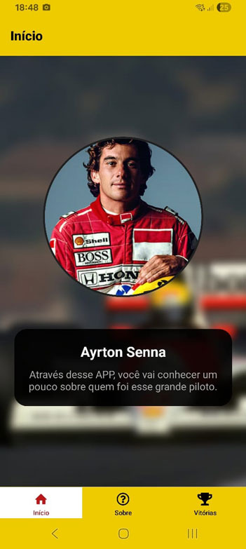

# SennaApp

## Descrição

Este projeto consiste em um aplicativo sobre o Ayrton Senna. O projeto foi proposto pela DevMedia para prática de react native.

---

## Demonstração



---

## Tecnologias Utilizadas

- **React Native** 
- **Expo**

---

## Como Executar Localmente

1. Clone este repositório
2. Acesse a pasta do projeto:
3. Instale as dependências:
```sh
npm install
```
4. Execute o projeto usando Node:
```sh
npx expo start
```
5. Abra [http://localhost:3000](http://localhost:3000) em seu navegador.

---

## Autor

- **Vinicius Lucio Lopes**
